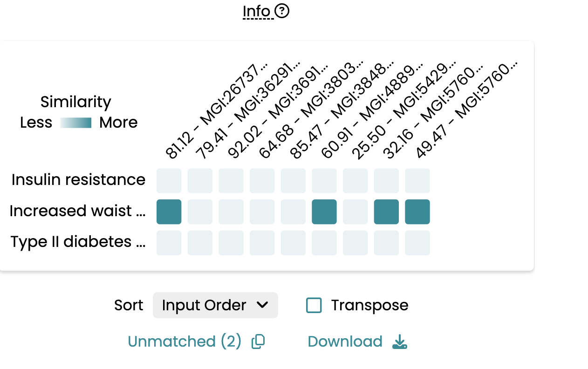

# Phenogrid for IMPC

This is a test repository to fine-tune the implementation of [Monarch's Phenogrid](https://github.com/monarch-initiative/monarch-app/blob/main/frontend/PHENOGRID.md) to the IMPC website.

## To display the Phenogrid:
1. Clone the repository to your local machine
2. Set up a local server using `http-server`
3. Run `http-server` from the root of the repository
4. Navigate to `project` 
5. Should you see a 'No Results' display, refresh the page to see the Phenogrid. Check the console for the message *'Iframe loaded successfully'*.

### Here is an example for the highest scoring disease-model match of [*Akt2*](https://www.mousephenotype.org/data/genes/MGI:104874):

